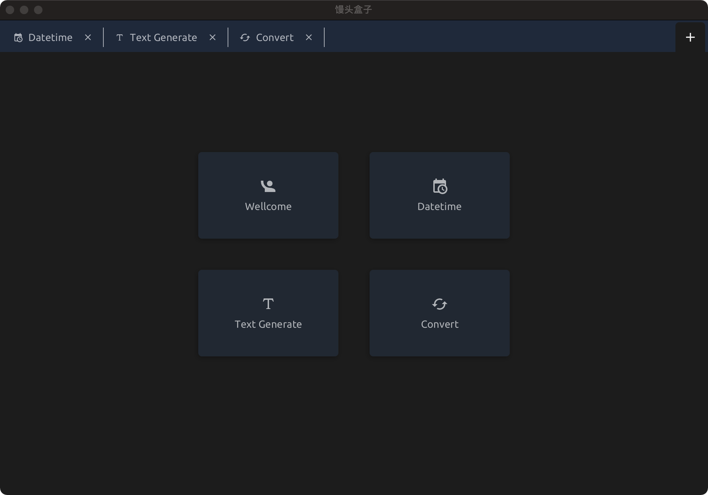

# Mantou Box - 馒头盒子

Develop tools build for developer, support multiple platforms.

Visit [mantoubox.fun](https://mantoubox.fun) to explore all the features. Feature request issues are wellcome!

<div>

</div>

## Install

### Windows

Execute the installer. If defender is poping up please click on "more info" and then on "run anyway"

### OSX

Goto in the download folder in Finder and right click on the installer file and click "Open". On OSX 11.x open the app and afterwards goto system settings - general tab in the Security & Privacy pane to instruct macOS to ignore its
  lack of notarization - click on "open anyway". 

An alternative way is to execute the following cmd on the terminal 'sudo xattr -r -d com.apple.quarantine /Applications/MantouBox.app'

### Linux

Download the deb package. Run 'sudo dpkg -i mantoubox_1.0-1_amd64.deb' and click on the icon or run /opt/mantoubox/bin/MantouBox

## Develop

### New Module

1. Add module package under `com.infilos.mantou.views`.
2. In module package, implement `NewModel`/`NewModule`/`NewService`/`NewView`/`NewView.fxml`.
3. In `com.infilos.mantou.MantouBoxApplication::startReactiveApp`, register the new module.

### Build Locally

- sdk use java 17.0.2.8.1-amzn
- mvn javafx:run
- mvn install -Ppackage

### Github Release

1. Push commit.
2. Push tag: `git tag v1.x` & `git push origin v1.x`
3. Create release manually on Github or with Github cli.

```sh
gh auth login
gh release create v1.x
```

## Thanks

I learned a lot while developing this project and am very grateful for the following projects:

- jtoolprovider-plugin
- maven-jpackage-template
- jfxtras-styles
- FXIconCreator
- WorkbenchFx
- ikonli
- ......
